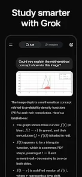

# Grok AI助手：你的智能对话伙伴，真的靠谱吗?

---

想找个AI助手聊天、生成图片，还能帮你理解这个世界？Grok最近挺火的，说是xAI开发的"最真实、最有用、最好奇"的AI。听起来不错，但实际用起来怎么样？我花了点时间研究了下，发现这事儿没那么简单。

---

## Grok是个什么东西？

先说说基本情况。Grok是xAI公司搞出来的AI助手，功能看起来挺全：能回答问题、生成图片和视频、语音对话、还能上传照片让它帮你分析。听起来像个全能选手，对吧？

但实际体验如何？用户评分4.8分，140多万条评价，看起来挺受欢迎。不过评分高不代表没问题，往下看就知道了。

## 功能挺多，但坑也不少

### 对话体验：个性化但不够靠谱

有个用户说得挺有意思："Grok学得很快，知道我喜欢什么样的对话方式。遇到刺激的事，它会喊我'老兄！'或者说'太棒了！'"听起来挺酷的，对吧？

但问题来了——**它经常出错**。这位用户说，Grok时不时给出错误信息，就算你纠正它，它道歉了，下次还是会犯类似的错误。这就尴尬了。你说你要个AI助手，结果它给你的信息不靠谱，那还有啥用？

如果你需要一个**真正稳定、可靠的AI工具**，特别是用来处理重要工作或学习任务，可能需要考虑更成熟的方案。👉 [想要更稳定的AI会员体验？试试Grok Super会员一个月成品号，质保30天](https://shaoyumi.com/buy/66)，至少不用担心频繁出错的问题。

### 图片生成：想法很好，执行很差

另一个用户吐槽得更狠。他说上传照片后，Grok会把图片顺序搞乱，完全不按你描述的来。更糟的是，让它生成图片时，**它总是改你不想改的地方**。你明确说了不要改某个细节，它偏偏就改了。

更让人无语的是，Grok的内容审核变得越来越严格。用户表示："我又没要求生成什么不健康的内容，它却在一些根本不过分的地方卡壳。"这种体验就像你让助手帮忙，结果它总是多管闲事。

### 语音导航：太快了，根本跟不上

还有个挺实际的问题。有用户说，当你问Grok需要在手机上操作的问题时，它的回答虽然准确，但说得**太快了**。你还没明白第一步怎么做，它已经讲到第五步了。而且，**它不接受你的暂停请求**，等它停下来的时候，你早就晕了。

这就像你问路，对方一口气说了十个路口的转向，你能记住才怪。

## 隐私问题：你的数据去哪了？

这是个更严肃的问题。根据应用说明，Grok可能会与第三方**共享这些数据**：
- 照片和视频
- 应用活动记录
- 还有其他两类数据

同时，它可能收集的数据包括：
- 位置信息
- 个人信息
- 还有其他五类数据

虽然数据传输是加密的，你也可以要求删除数据，但问题是：你愿意让这么多信息被收集和分享吗？特别是当这个应用本身的功能表现还不够稳定的时候。

## 适配设备还算全面

这是为数不多的优点之一。Grok支持：
- 手机
- Chromebook
- 平板电脑

不管你用什么设备，基本都能装上。但问题还是那个问题——装上了能不能好好用，那是另一回事。

## 说实话：该用还是不该用？

总结一下。Grok有几个优点：
- 对话比较个性化，能适应你的说话风格
- 功能挺全，对话、图片、语音都有
- 跨平台支持不错

但缺点也很明显：
- **准确性不够**，经常给出错误信息
- 图片生成功能**不听指令**，还容易过度审核
- 语音导航**节奏太快**，实用性打折扣
- 收集和分享的**数据类型比较多**

我的看法是这样：如果你只是想找个AI聊聊天、玩一玩，Grok还算有趣。但如果你需要用AI来处理正经事儿——比如工作、学习、创作——它目前的表现不够靠谱。错误信息、不听指令这些问题，在关键时刻可能会让你抓狂。

---

## 结语

Grok的想法挺好：做一个"最真实、最有用、最好奇"的AI助手。但从用户反馈来看，它还有很长的路要走。如果你对AI助手的要求比较高，特别是在准确性和稳定性方面，可能需要考虑其他选择。

当然，如果你想尝试更成熟的AI会员服务，确保功能稳定、不频繁出错，👉 [Grok Super会员一个月成品号（质保30天）](https://shaoyumi.com/buy/66)是个不错的选择，至少能省去很多折腾的时间。毕竟，工具是用来提高效率的，而不是给自己找麻烦的。
