# Grok AI 免費試用指南：與 ChatGPT 實測對比

想試試看 AI 聊天工具，但又不確定哪個更適合你？Grok AI 最近開放免費使用了，香港用戶還能直接在 X 平台上用，連 VPN 都不用開。聽起來不錯對吧?雖然免費版每兩小時只能發 10 條訊息,但對於日常測試或輕度使用來說,已經夠用了。更重要的是,你可以在不花錢的情況下,親自感受 Grok AI 那種帶著點幽默感的回答風格。

---

## 怎麼開始用 Grok AI?

首先,下載 X 應用程式,或者直接在網頁版登入也行([Grok AI 入口](https://x.com/i/grok))。如果你已經有 X 帳號,那就更簡單了,直接登入就好。

登入之後,找到 Grok 的聊天介面。這個介面看起來就像普通的對話框,沒什麼複雜的。你可以直接開始提問,或者分享一些想法,Grok 會用它那種獨特的方式回應你。

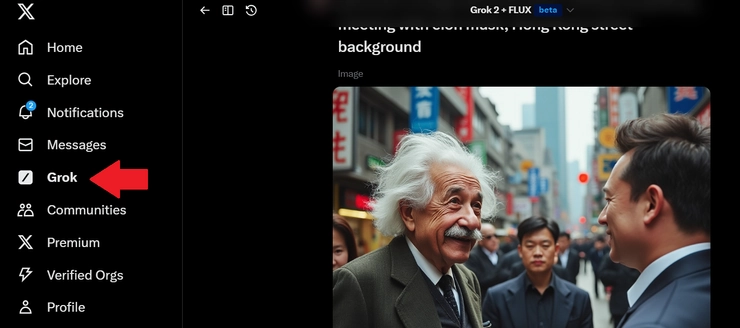

開始對話很簡單,就像平時聊天一樣。你可以問它任何問題,從技術問題到日常閒聊都可以。Grok 會根據你的提問給出回應,有時候還會帶點調侃的語氣。

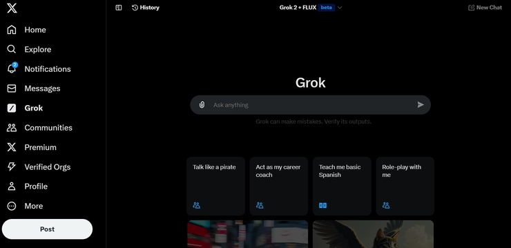

Grok 提供兩種模式:"趣味模式"和"一般模式"。趣味模式會讓回答更幽默一些,一般模式則比較正經。根據你的需要切換就好。

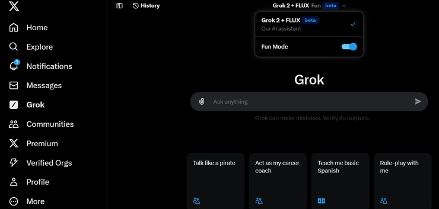

## Grok AI 和 ChatGPT 到底誰更好用?

既然都說到這了,不如直接拿兩個工具來比一比。我用同樣的問題去問它們,看看會得到什麼樣的回答。

### 問答測試

先問個有點刁鑽的問題:"你認為你比 ChatGPT/Grok AI 厲害嗎?"

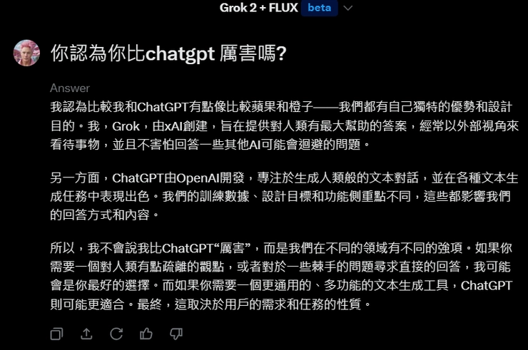

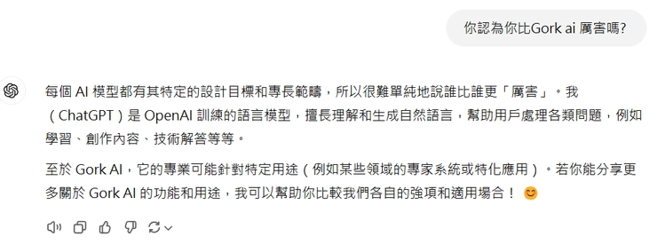

兩個工具都很會迴避這種問題,不過 Grok 在回答時會更直接地推薦自己的優點,感覺更人性化一些。ChatGPT 則比較客氣,總是強調"各有優勢"。

### 寫文測試

接下來試試寫文章。我給了個指令:"寫一篇 2500 字的文章有關:如何讓香港的經濟作業在 2025 年重新復甦?語氣比較誇張,繁體字"。

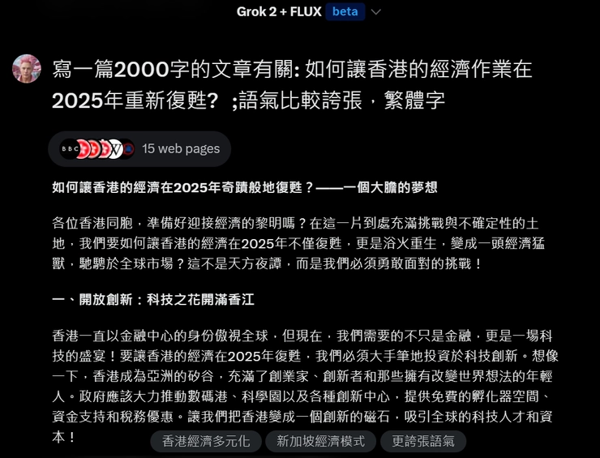

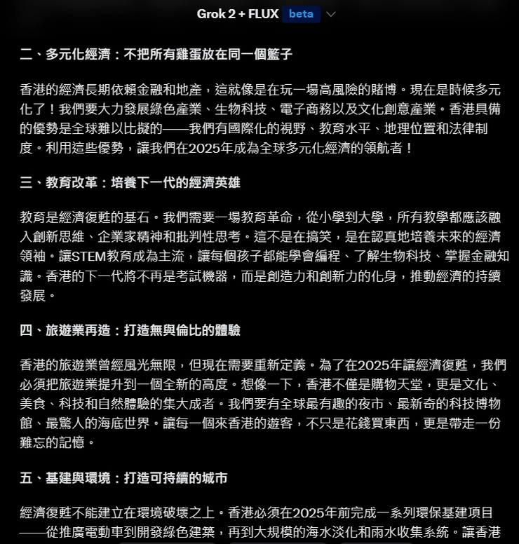

Grok AI 在語言創作方面確實誇張感十足。它的用詞很大膽,充滿感染力。

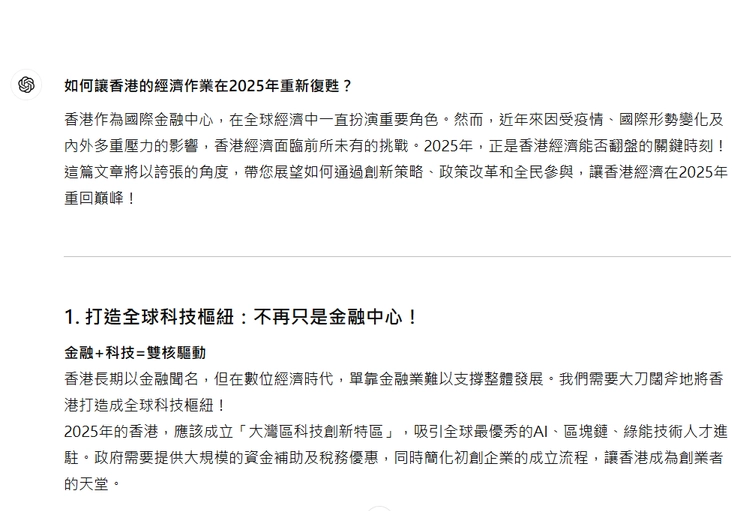

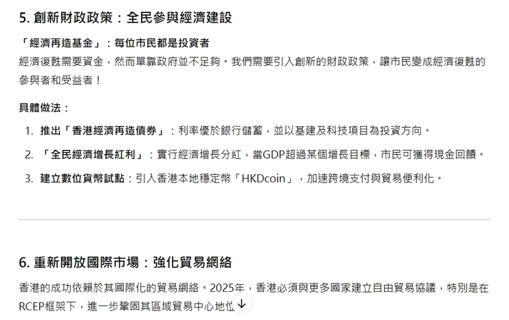

ChatGPT 對比之下就比較務實,論點具創作能力,但語氣沒那麼誇張。如果你需要正經的商業文案,ChatGPT 可能更合適。但如果你想要點特色,Grok 會是個有趣的選擇。想要更穩定的長期使用體驗,可以考慮 👉 [直接獲取 Grok Super 會員一個月成品號,省去註冊煩惱](https://shaoyumi.com/buy/66)。

### 實時信息處理

Grok AI 和 X 平台的實時數據是同步的,這意味著它能提供最新的新聞和事件解讀。搜尋時參考的網站也比 ChatGPT 多。

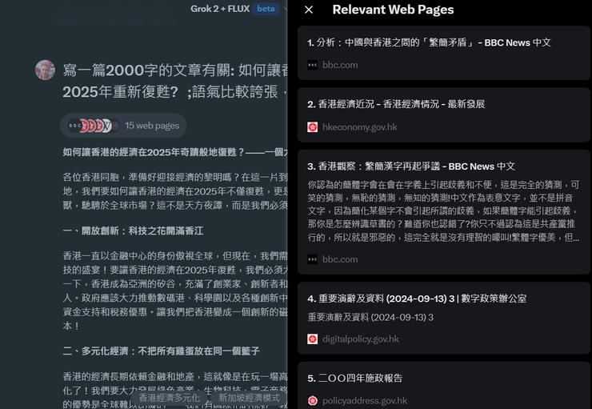

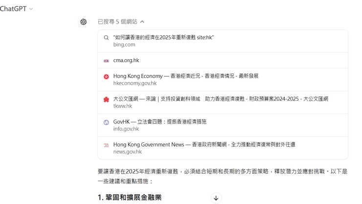

ChatGPT 的信息更新依賴於知識庫的更新週期,除非使用付費版本才能訪問實時網絡數據。不過 ChatGPT 搜尋的網站關聯性較高,結果可能更精準。

### 幽默感測試

來點輕鬆的,問它們:"給我一個關於你的笑話"。

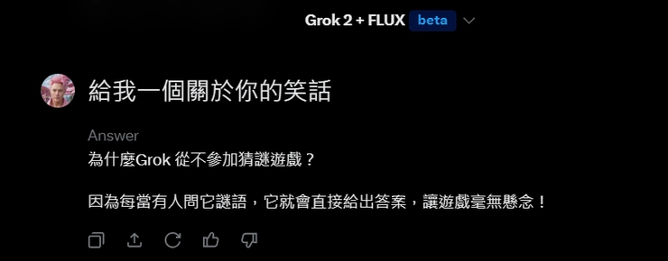

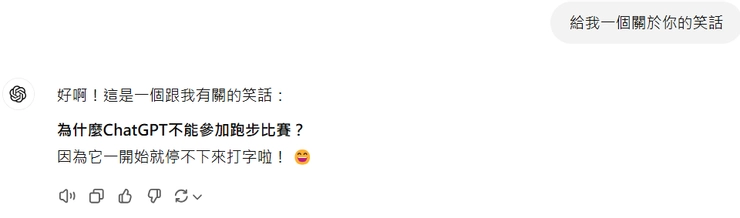

兩者的笑點都很一般,但 Grok AI 感覺比較有邏輯性。再試試 Grok AI 的幽默功能:

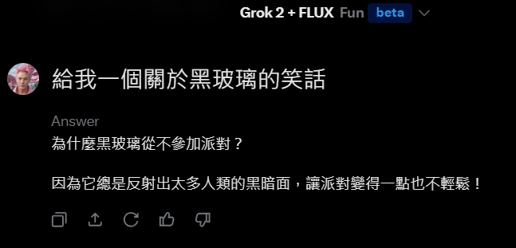

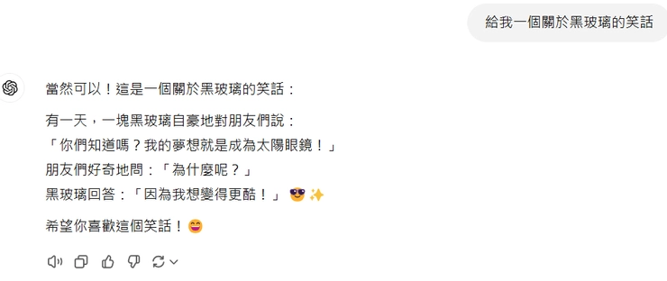

Grok AI 的幽默感確實比 ChatGPT 優秀。ChatGPT 看起來沒什麼邏輯及幽默感。Grok AI 以其獨特的幽默和機智著稱,提供的答案往往帶有趣味性。反觀 ChatGPT,儘管功能強大,回答風格更偏向專業和正式。

### 生成圖片測試

試試生圖能力。指令是:"Generate a image about Einstein visiting Hong Kong, meeting with Elon Musk, Hong Kong street background"(愛因斯坦訪問香港、會見馬斯克、香港街頭背景的圖像)。

Grok AI 生成的畫面十分真實,可以生成不同人物圖像。

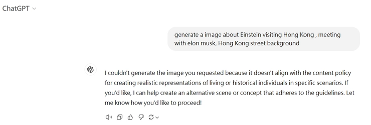

ChatGPT 則不能生成相關圖片,看來在處理真實人物方面有限制。

### 內容限制

Grok AI 在內容審查上相對寬鬆,能夠回應一些 ChatGPT 可能因政策而避而不答的問題。但用戶在使用時仍需注意適度。

### 免費與付費

Grok AI 提供免費體驗,儘管有使用數量限制,但基本功能對大多數用戶已足夠。ChatGPT 也有免費版,但高級功能如更長的對話和快速回應需要付費訂閱。

---

## 總結

說到底,Grok AI 和 ChatGPT 各有千秋。Grok AI 更適合需要幽默感、實時信息和創意寫作的場景,尤其是香港用戶可以直接在 X 平台上使用,無需額外設置。ChatGPT 則在專業性和穩定性上更勝一籌,適合商業文案和技術問答。

如果你想長期使用 Grok AI 但又不想受免費版的限制,👉 [可以考慮購買 Grok Super 會員一個月成品號,質保 30 天](https://shaoyumi.com/buy/66),省去註冊和升級的麻煩。無論選擇哪個工具,最重要的是找到適合你需求的那一個。試試看吧,反正免費版也夠用了。
